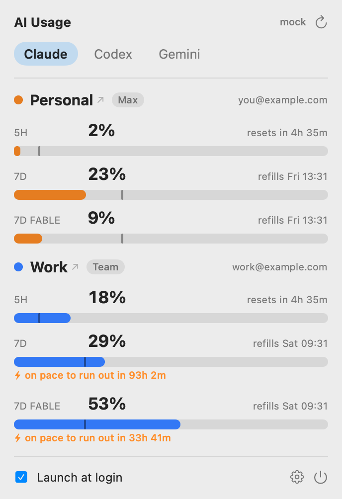

# ai-usage-bar

A native macOS menu-bar app that shows your AI-coding usage/limits for **Claude**
(multiple profiles), **Codex**, and **Gemini** at a glance — inspired by
[CodexBar](https://github.com/steipete/CodexBar), extended for a multi-tool,
multi-profile setup. All reads are local; nothing leaves your machine.



## What it shows

- **Menu bar**: `Cx 2%  Cl 61%` text chips, or CodexBar-style **dual-bar meter icons**
  (5h over weekly) — toggle in settings. Threshold-colored (green `<50` · yellow `<75` · orange `<90` · red).
- **Dropdown**: tabs by provider (Claude · Codex · Gemini). Under Claude both profiles stack,
  color-coded, with per-model windows (`5H` · `7D` · `7D FABLE`/`OPUS`/`SONNET`). Each window is a
  meter with `% used`, a **pace tick** ("where you should be"), `resets in…`/`refills…`, plan, account.
- **Burn-rate**: a `⚡ on pace to run out in 1h 3m` warning appears only when a window is
  projected to hit the limit before it resets.
- **Notifications**: native alerts when a window crosses 75% / 90% or is burning too fast.
- **Convenience**: click a provider name to open its usage dashboard; a stale-data badge when the
  endpoint is failing; a copy-the-sign-in-command helper for profiles not in the Keychain.

## Data sources

| Provider | How | Fidelity |
|---|---|---|
| **Codex** | Reads the newest `~/.codex/sessions/**/rollout-*.jsonl` `token_count` event (tail only). True 5h/weekly %, reset times, plan, credits, tokens. | Full, zero-auth |
| **Claude** | `GET api.anthropic.com/api/oauth/usage` per profile (token from Keychain `Claude Code-credentials-*`). Identity from each `.claude.json`. Falls back to local token activity if the endpoint is unavailable. | Full % via endpoint; activity fallback |
| **Gemini** | Detects `gemini-cli`; shows the plan cap or "not detected". No live % (gemini-cli persists none). | Best-effort |

See [DESIGN.md](DESIGN.md) for the full research and architecture.

## Claude profiles

Profiles are auto-detected from config dirs. On this machine:

- **Personal** → `~/.claude`
- **Work** → `~/.claude-work` (your `CLAUDE_CONFIG_DIR=~/.claude-work` alias)

Each profile's account/plan comes from its `.claude.json`; its OAuth token is read
from the Keychain (enumerated — the per-profile hash suffix can't be computed).
**First launch pops a Keychain prompt per profile — click "Always Allow".**

## Build & run

Requires Xcode / Swift 6 (macOS 14+).

```bash
# Build + assemble the .app (menu-bar agent, no Dock icon)
Scripts/build-app.sh            # → dist/AIUsageBar.app
Scripts/build-app.sh --run      # build and launch
Scripts/build-app.sh --install  # copy to /Applications (needed for launch-at-login)
```

Settings (gear menu): refresh cadence, per-provider toggles, launch-at-login.

### Dev tools

```bash
swift test                      # unit tests (readers, parsing)
swift run usageprobe codex      # print parsed Codex usage (no network/Keychain)
swift run usageprobe all        # everything (reads Keychain + endpoint)
swift run previewgen <dir>      # render label + panel PNGs
AIUSAGEBAR_NO_KEYCHAIN=1 ...     # skip Keychain/endpoint (Claude → activity fallback)
```

## Notes & limitations

- The Claude usage endpoint is **undocumented/unstable**; the app caches ≥180s, sends the
  required `User-Agent: claude-code/<ver>` header, and degrades gracefully on 429.
- Gemini has **no local quota signal** today — it shows detection + plan cap only.
- **Signing**: `Scripts/build-app.sh` ad-hoc signs for local use. For distribution to
  other Macs you need an Apple Developer ID + notarization (see DESIGN.md).

## Roadmap

- Cost & tokens ($ today / 30d, ccusage-style) + usage-history sparkline.
- Claude `/usage` PTY fallback; optional live Codex OAuth refresh.
- Sparkle auto-update, Homebrew cask, WidgetKit widget.
