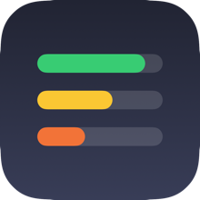
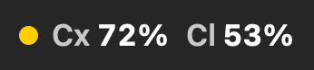
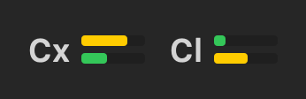
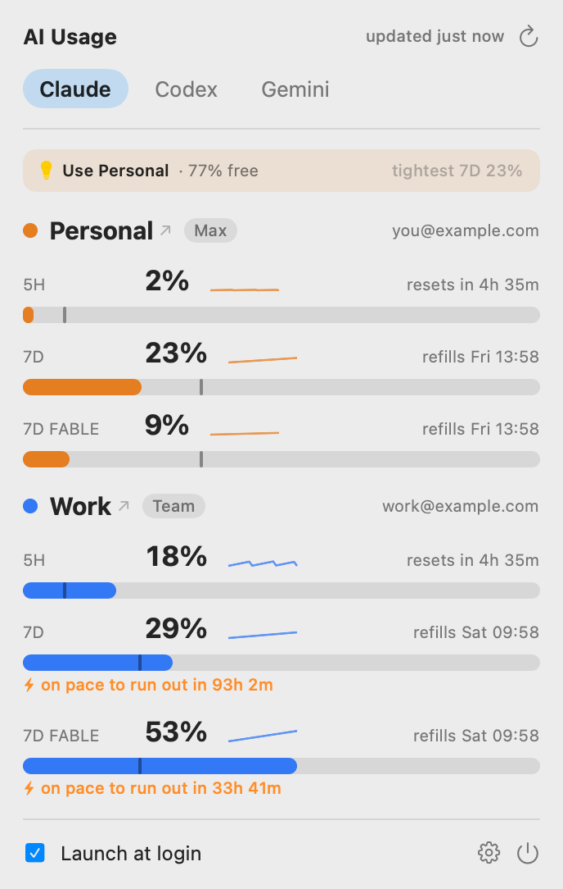
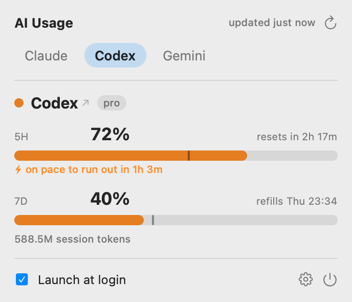
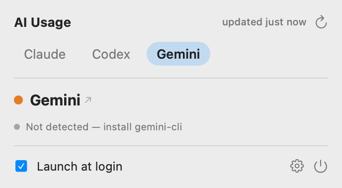
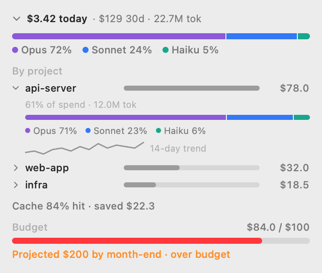
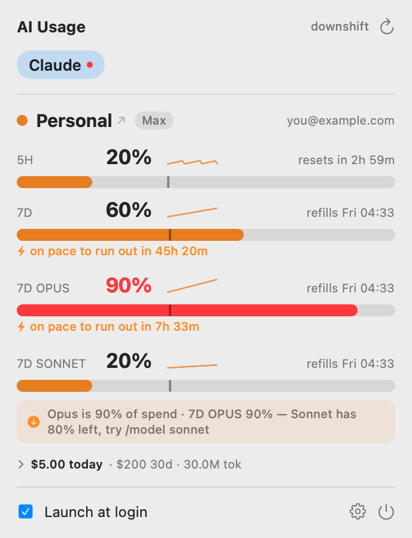
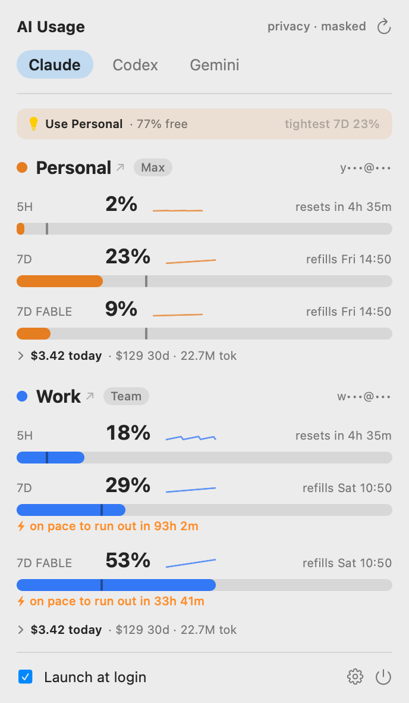

<div align="center">



# ai-usage-bar

**Every AI-coding limit, in your menu bar.**

A tiny, native macOS menu-bar app that shows your **Claude**, **Codex**, and **Gemini**
usage — 5-hour and weekly windows, reset timers, burn-rate warnings — for multiple
accounts at a glance. Everything is read locally; nothing leaves your machine.

<p>
  <a href="https://github.com/Balanced02/ai-usage-bar/actions/workflows/ci.yml"></a>
  
  
</p>


&nbsp;&nbsp;or&nbsp;&nbsp;


</div>

---

<p align="center">
  
  
  
</p>

<p align="center"><sub>Tabs by provider. Under Claude, every profile stacks together — color-coded, with per-model windows. (Mock data.)</sub></p>

## Features

- **All your providers, one glance** — tabs for Claude, Codex, and Gemini. Claude shows
  **multiple profiles** (e.g. personal + work) stacked together, color-coded.
- **Per-model windows** — `5H`, `7D`, and per-model weekly meters (`7D FABLE`, `7D OPUS`,
  `7D SONNET`) that appear only when you've used that model.
- **Pace tick** — a marker on each meter shows *where you should be* (time elapsed) vs where
  you are, so you can see at a glance if you're burning fast.
- **Burn-rate warnings** — `⚡ on pace to run out in 1h 3m` appears only when a window is
  actually projected to hit the limit before it resets.
- **Notifications** — native alerts when a window crosses 75% / 90%, is burning too fast, or clears.
- **Cost & analytics** — an equivalent-$ breakdown per account: today / 30-day, **by model**,
  **by project**, cache-hit efficiency, a **month-end forecast**, and an optional **budget gauge** —
  all computed from your local logs (see below).
- **Model-downshift nudge** — when your priciest model is eating its weekly limit and a cheaper one
  has room: *"Opus is 90% of spend · 7D Opus 90% — Sonnet has 80% left, try /model sonnet"*.
- **Best-account hint** — "Use Work — 88% free" when you have multiple profiles, so you don't
  burn the wrong account before a big task.
- **Trends** — an inline sparkline of each window's recent history (on-disk timeseries).
- **Four menu-bar styles** — text (`Cx 2%  Cl 61%`), dual-bar meters, single number, or a dot.
  Right-click the icon for a quick menu (peek, copy snapshot, dashboards).
- **Click-through** to each provider's dashboard, a stale-data badge when an endpoint is failing,
  and a sign-in helper for profiles that aren't authenticated yet.
- **Native & tiny** — SwiftUI + AppKit, no Dock icon, launch-at-login, ~15 MB.

Threshold colors: green `< 50` · yellow `< 75` · orange `< 90` · red. Bars use each account's
color for grouping and escalate to orange/red near the limit.

<p align="center">
  
  
</p>
<p align="center"><sub>Left: expand any account's cost line for model mix, per-project spend, cache efficiency, forecast &amp; budget. Right: the downshift nudge when a pricey model is eating its weekly limit.</sub></p>

## How it reads usage

Everything is local — no proxy, no telemetry, no account of ours.

| Provider | Source | Fidelity |
|---|---|---|
| **Codex** | Newest `~/.codex/sessions/**/rollout-*.jsonl` `token_count` event — real 5h/weekly %, resets, plan, credits, tokens. Zero-auth. | ✅ Full |
| **Claude** | `GET api.anthropic.com/api/oauth/usage` per profile (OAuth token from the Keychain, account matched via `/api/oauth/profile`). Falls back to local token-activity if the endpoint is unavailable. | ✅ Full % |
| **Gemini** | Detects `gemini-cli`; shows the plan cap or "not detected". gemini-cli persists no live quota. | ⚠️ Best-effort |

Claude profiles are **auto-discovered** by parsing `CLAUDE_CONFIG_DIR=…` out of your shell rc
files, so a `claude-work` alias just works. See [DESIGN.md](DESIGN.md) for the full write-up.

## Install

**Download:** grab the latest `.app` from [Releases](https://github.com/Balanced02/ai-usage-bar/releases).
It's ad-hoc signed, so on first launch right-click the app → **Open** (or `xattr -dr com.apple.quarantine AIUsageBar.app`), then move it to `/Applications`.

**Build from source** (macOS 14+, Xcode / Swift 6):

```bash
git clone https://github.com/Balanced02/ai-usage-bar.git
cd ai-usage-bar
Scripts/build-app.sh --install   # build → /Applications → launch
```

- `Scripts/build-app.sh` — build + bundle into `dist/AIUsageBar.app`
- `Scripts/build-app.sh --run` — build and launch in place
- `Scripts/build-app.sh --install` — copy to `/Applications` (recommended; needed for launch-at-login)

On first launch, macOS asks to **Allow** Keychain access (for the Claude token) and to send
**notifications** — approve both. The build is ad-hoc signed, so the Keychain prompt reappears
after a rebuild; install once and you won't see it again. For distribution to other Macs you'd
need an Apple Developer ID + notarization.

## Settings

Click the gear in the panel: refresh cadence, per-provider toggles, menu-bar style
(text / meters), notifications on/off, and launch-at-login.

## Privacy

All usage is read from local files and your existing Keychain credentials. The app makes no
network calls except Claude's own usage endpoints, using your own token — the exact requests
Claude Code already makes. Nothing is uploaded, logged remotely, or shared.

**Screen-sharing?** Flip **Mask account details** (gear menu) to hide emails (`y•••@•••`, domain
removed) and repo names (`Project 1`, `Project 2`) so a demo doesn't reveal where you work. It's
persisted, so it stays on until you turn it off.

<p align="center"></p>

## Developer tools

```bash
swift test                    # unit tests (readers, parsing, discovery)
swift run usageprobe codex    # print parsed Codex usage (no network / Keychain)
swift run usageprobe profiles # list discovered Claude profiles
swift run previewgen <dir>    # render the UI to PNGs
```

## Limitations & roadmap

- The Claude usage endpoint is **undocumented / unstable**; the app caches ≥180s and degrades
  gracefully, but Anthropic could change it.
- Gemini has no local live signal until `gemini-cli` exposes one.
- Planned: cost & tokens ($ today / 30d) + usage-history sparkline, Sparkle auto-update,
  Homebrew cask, WidgetKit widget.

## Credits

Inspired by [CodexBar](https://github.com/steipete/CodexBar) (MIT) by Peter Steinberger, and
[ccusage](https://github.com/ryoppippi/ccusage) (MIT). Built independently.

## License

[MIT](LICENSE).
